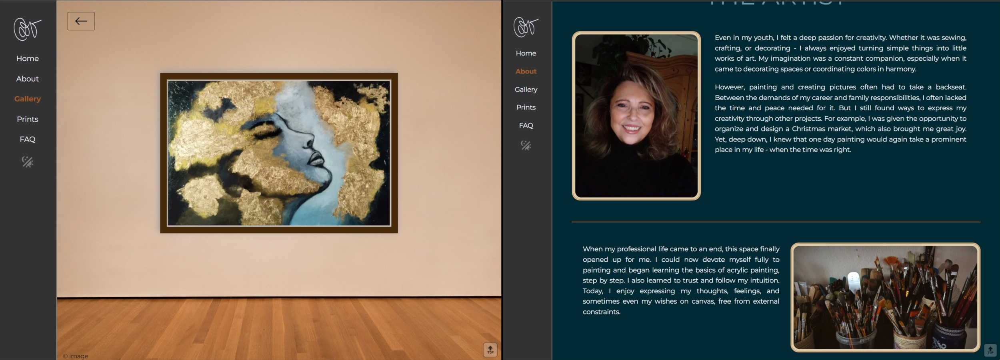
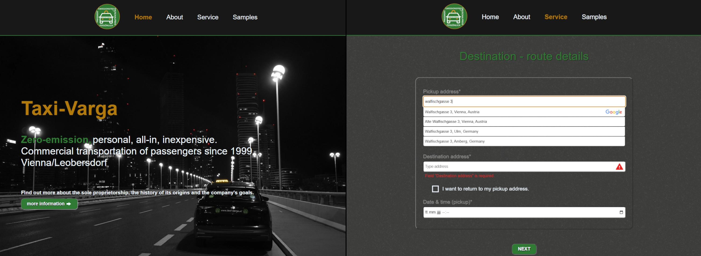

    

# Hey, I'm Fullstack developer [$\textsf{\color{orchid}{Lukas Varga}}$ 👩🏻‍💻](https://yqni13.com)

    
    
    

  

        
        
        

 

 

### I’m currently learning more about $\textsf{\color{goldenrod}{animations on scroll}}$ in depth 🌱. The following shows my current main projects, descriptions and reasons why I built them:

 

## ⭐ [$\textsf{\color{salmon}{Support hub}}$](https://github.com/yqni13/support)

### Handling feedback & ratings and bug/support requests including file attachments across multiple applications via REST API built with $\textsf{\color{goldenrod}{NodeJS}}$ (Typescript), Express & $\textsf{\color{goldenrod}{PostgreSQL}}$ in $\textsf{\color{goldenrod}{Docker}}$ container. Created following Test-Driven Development (450+ tests including ephemeral database by testcontainers) and hosting env:prod via Render, Neon and $\textsf{\color{goldenrod}{Cloudflare}}$.

    

## 🖼️ [$\textsf{\color{salmon}{Art gallery}}$](https://github.com/yqni13/artcreation-dv)

### An art gallery website to display the artist (my lovely mom), her artwork and news about future/current/past exhibitions. Images are stored in cloud storage, with their paths persisted in a $\textsf{\color{goldenrod}{PostgreSQL}}$ database. The web application uses $\textsf{\color{goldenrod}{Angular}}$ and $\textsf{\color{goldenrod}{NodeJS}}$ (Javascript) and is hosted via Netlify, Vercel, Neon and $\textsf{\color{goldenrod}{Cloudflare}}$.

### visit the <a href="https://artcreation-dv.at" target="_blank">WEBSITE</a>

    

## 🚕 [$\textsf{\color{salmon}Taxi Service}$](https://github.com/yqni13/taxi-varga)

### A website to inform about my fathers taxi services including custom price calculation tools and mail-reservation. Route calculations are based on $\textsf{\color{goldenrod}{Google API}}$ for Routes, Places and Geolocation. The web application uses $\textsf{\color{goldenrod}{Angular}}$ and $\textsf{\color{goldenrod}{NodeJS}}$ (Javascript) and is hosted via Netlify and Vercel.

### visit the <a href="https://taxi-varga.at" target="_blank">WEBSITE</a>

    

 

> [!TIP]
> ### Visit me for more information: [$\textsf{\color{limegreen}My Homepage}$](https://yqni13.com)