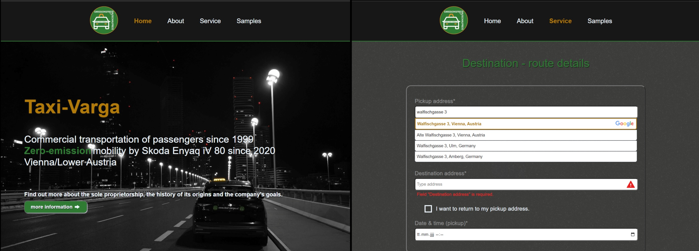

    

<h1 align="center">
    Hey, I'm 
    <a href="https://yqni13.com">Lukas Varga</a>
    🧸
</h1>

<h3 align="center">
    
        Web Development from Austria&nbsp;
    
    
</h3>

 

        
        
        

 

    <dl style="font-size:20px;">
        <dd>🌱 I’m currently learning to test with ephemeral databases via <a href="https://testcontainers.com/guides/getting-started-with-testcontainers-for-nodejs/" target="_blank">testcontainers</a>.</dd>
        <dd>👯 I’m looking to collaborate on Angular / NodeJS or .NET projects.</dd>
    </dl>

 

<h2 style="font-size:26px;">
Current projects
</h2>

 

<h3 style="font-size: 22px;">

[Art gallery](https://github.com/yqni13/artcreation-dv)

</h3>

An art gallery website to display the artist (my lovely mom), her artwork and news about future/current/past exhibitions. Images are handled by PostgreSQL database combined with Cloudflare CDN. The web application uses Angular + NodeJS (Javascript) and is hosted via Netlify, Vercel and Neon.

    

<h3 style="font-size: 22px;">

[Taxi services](https://github.com/yqni13/taxi-varga)

</h3>

A website to inform about my fathers taxi services including custom price calculation tools and mail-reservation. Route calculations are based on Google API for Routes, Places and Geolocation. The web application uses Angular + NodeJS (Javascript) and is hosted via Netlify and Vercel.

    

<h3 style="font-size: 22px;">

[Support service](https://github.com/yqni13/support)

</h3>

A backend application to handle bug reports or support on request. The application will use (alpha version) PostgreSQL database and Cloudflare CDN to handle resources and full Docker/Jenkins setup to host on Render. Using NodeJS (Typescript) and TDD methodology for project development.

    

 

Visit me for more information: [Homepage](https://yqni13.com)
